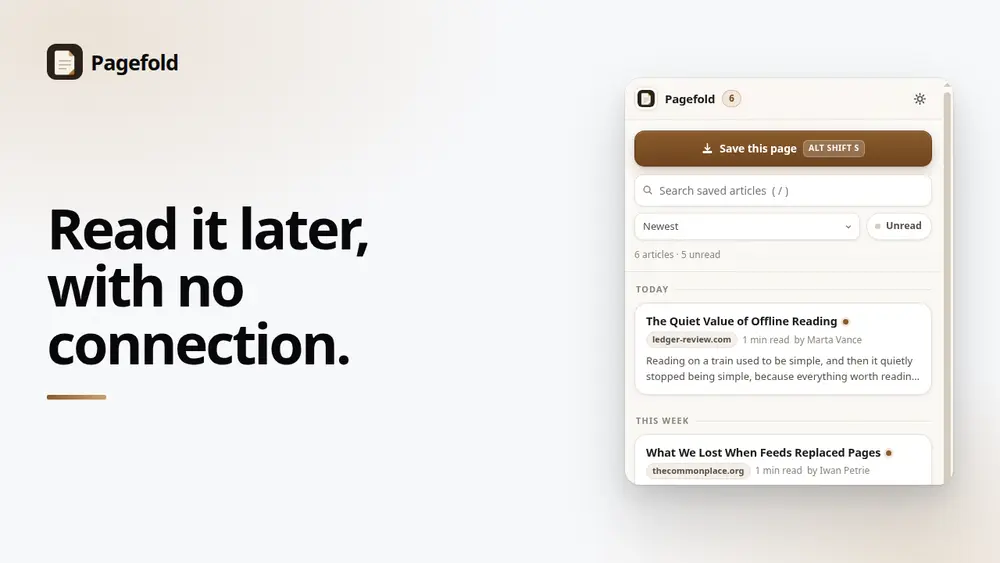
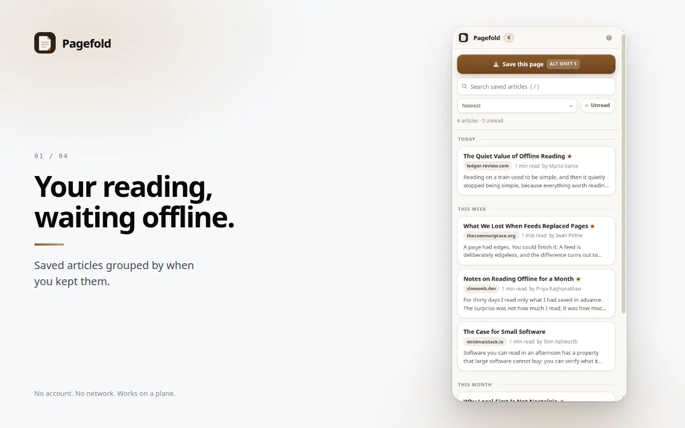
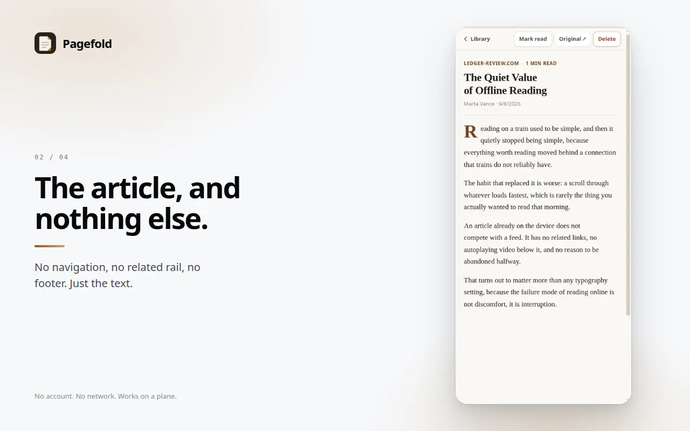
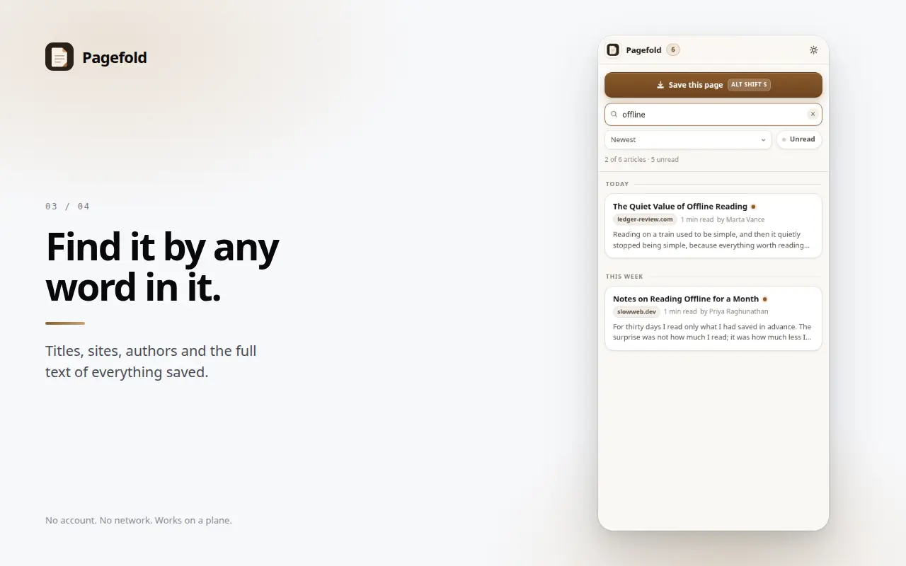
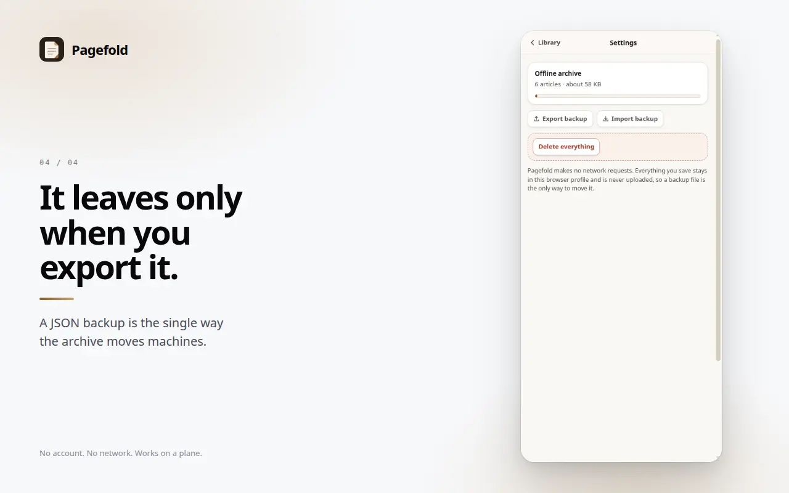

# Pagefold

Save any article and read it offline. Nothing is uploaded, there is no account,
and the extension makes no network requests at all.

[](https://github.com/royalpinto007/Pagefold/actions/workflows/ci.yml)
[](LICENSE)
[](manifest.json)
[](#how-it-works)

<!-- media:start -->

<p align="center">
  
</p>

<h3 align="center">Read it later, with no connection.</h3>

<p align="center">
  <a href="docs/media/demo.mp4">
    
  </a>
  <br>
  <a href="docs/media/demo.mp4"><b>Watch the 30 second demo</b></a>
</p>

## Screenshots



<sub>Your reading, waiting offline.</sub>

<details>
<summary><b>See 3 more</b></summary>

### Reader



<sub>The article, and nothing else.</sub>

### Search



<sub>Find it by any word in it.</sub>

### Settings



<sub>It leaves only when you export it.</sub>

</details>

<sub>Every screenshot is captured from the real extension running in Chrome, not
mocked up, so they cannot drift from what the product actually does. Regenerate
them with the tooling in the store-publishing workspace.</sub>

<!-- media:end -->

## What it does

Press the shortcut on an article and Pagefold keeps the readable text on your
device. Later, on a train or a plane or a hotel network that has given up, the
side panel still opens and the article is still there.

- **Reader view.** Just the article: no nav, no related-posts rail, no footer.
- **Search.** Across titles, sites, authors and the full body text.
- **Unread and progress.** It remembers how far down you were.
- **Backup.** Export to a JSON file, import it back on another machine.

## Why it exists

Read-later tools sync to an account, which means they need a connection to be
useful and a company to stay alive. Pagefold does neither. The archive is a
local database in your browser profile, and a backup file is the only way it
ever leaves.

That constraint is the product, not a limitation of it.

## Privacy

Pagefold makes **no network requests**. There is no backend, no analytics, no
telemetry and no account, and you can check that claim yourself:

```bash
npm run build
grep -rE "fetch\(|XMLHttpRequest|WebSocket|sendBeacon" dist/
```

That returns nothing, and CI fails the build if it ever stops doing so.

## Permissions

Deliberately short, and one of them is optional.

| Permission                | Why                                                        |
| ------------------------- | ---------------------------------------------------------- |
| `activeTab`               | Read the page you are saving, at the moment you save it    |
| `scripting`               | Inject the extractor into that one page                    |
| `sidePanel`               | The reader and the list                                    |
| `contextMenus`            | The right-click Save item                                  |
| `storage`                 | Your sort and filter preferences                           |
| `<all_urls>` _(optional)_ | Only requested if you use the Save button inside the panel |

The last one is worth explaining. Chrome grants `activeTab` when you act on the
extension itself: the keyboard shortcut, the context menu, the toolbar icon. A
button inside the side panel is not one of those, so saving from there needs
broader access. Rather than declare it at install and show everyone a scary
prompt, Pagefold asks the first time you press that button. Use
<kbd>Alt</kbd>+<kbd>Shift</kbd>+<kbd>S</kbd> and it never asks at all.

## How it works

```
keyboard shortcut / context menu / panel button
        │
        ▼
service worker  ──inject──▶  extractor runs in the page
        │                            │
        │  ◀────── article text ─────┘
        ▼
   IndexedDB  ◀──────▶  side panel: list, search, reader
```

**Extraction** scores each container by how much of it is prose, dividing by
link density so a nav block cannot win on length alone, then takes the
paragraphs from the winner. It is about 150 lines rather than a Readability
port, because a zero-network extension should be small enough to read.

**Storage** is IndexedDB, not `chrome.storage.local`. That API caps at around
10MB without the `unlimitedStorage` permission, which is a few hundred
articles, and hitting the cap loses saves silently. IndexedDB has no such cap
and needs no permission, which also keeps the list above short.

## Install from source

```bash
npm ci
npm run build
```

Then open `chrome://extensions`, enable Developer mode, choose Load unpacked
and select this folder.

## Development

| Command                | What it does                                               |
| ---------------------- | ---------------------------------------------------------- |
| `npm run build`        | Typecheck, then bundle the three entry points into `dist/` |
| `npm test`             | Unit tests for extraction, search, formatting and backup   |
| `npm run typecheck`    | `tsc --noEmit`                                             |
| `npm run format:check` | Prettier                                                   |

The logic that decides what the product feels like is pure and covered by
tests: URL normalisation, search ranking, relative dates, and backup parsing.
The parts that need a browser are verified by loading the built extension into
a real Chrome and driving it.

## Contributing

See [CONTRIBUTING.md](./CONTRIBUTING.md). Good first issues are labelled
[good first issue](https://github.com/royalpinto007/Pagefold/labels/good%20first%20issue).

## Privacy

No accounts, no analytics, and nothing about you is collected.
Full policy: <https://privacy.signalizeai.org/pagefold>

## License

[MIT](./LICENSE)
